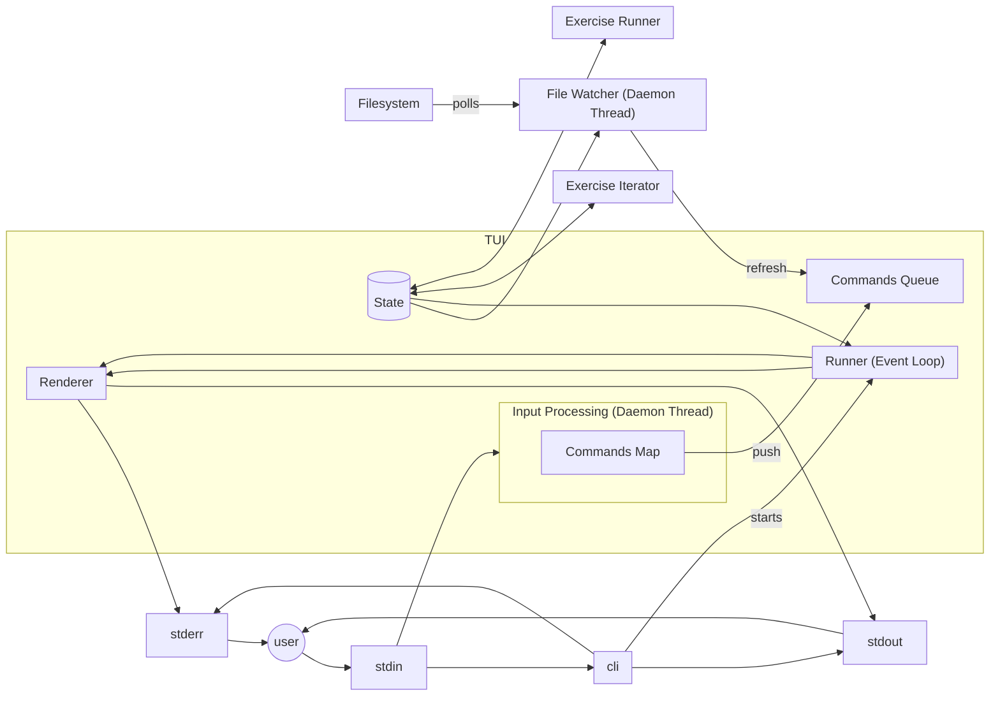

# Architecutre

```mermaid
flowchart LR
    user((user))


    stdout
    stdin
    stderr

    subgraph cli["cli"]
    end

    subgraph tui["TUI"]
        commands_queue["Commands Queue"]
        tui_state[("State")]

        subgraph input["Input Processing (Daemon Thread)"]
            commands_map["Commands Map"]
        end

        subgraph runner["Runner (Event Loop)"]
        end

        subgraph renderer["Renderer"]
        end
    end

    subgraph exercise_iterator["Exercise Iterator"]
    end

    subgraph exercise_runner["Exercise Runner"]
    end

    subgraph watcher["File Watcher (Daemon Thread)"]
    end

    subgraph filesystem["Filesystem"]
    end

    %%connections%%
    stdout --> user
    user --> stdin --> input
    stderr --> user

    cli --> stdout
    stdin --> cli
    cli --> stderr
    cli --starts--> runner

    runner --> renderer --> stderr
    runner --> renderer --> stdout
    commands_map --push--> commands_queue

    filesystem --polls--> watcher --refresh--> commands_queue

    tui_state --> watcher
    tui_state --> runner
    tui_state <--> exercise_iterator
    tui_state <--> exercise_runner
```
